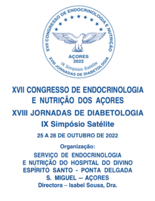

# XVII Congresso de Endocrinologia Diabetes e Nutrição dos Açores - 2022
# XVIII Jornadas de Diabetologia 
# IX Simpósio Satélite

Para aceder ao site do XVI Congresso - 2019, por favor clique [aqui](http://2019.endodiabnut.org): [http://2019.endodiabnut.org](http://2019.endodiabnut.org) .

    
  
## Carta-Convite

Caro Colega  

O Serviço de Endocrinologia e Nutrição do Hospital do Divino Espírito Santo, tem em preparação o XVII Congresso de Endocrinologia e Nutrição dos Açores, as XVIII Jornadas de
Diabetologia e o IX Simpósio Satélite de Nutrição, a realizar de 25 a 28 de Outubro do ano de 2022, em Ponta Delgada.

Apesar de ainda vivermos tempos conturbados e bem difíceis, à conta de uma pandemia que não nos quer dar tréguas, sempre fomos otimistas e como o povo diz “Não há bem que sempre dure, nem mal que nunca acabe”! Acreditamos que a exemplo do que aconteceu este ano, durante o Verão e início de Outono, que para o ano, os tempos hão de estar melhores!

Estamos todos ansiosos para nos voltar a encontrar ao fim de 3 anos, presencialmente, nesta ilha paradisíaca, como é S. Miguel, entre 25 e 28 do mês de Outubro de 2022. A qualidade científica das nossas reuniões, dizemo-lo com sentido orgulho, não pode deixar de acontecer e por isso assumimos a sua continuação, ajudando o Serviço de Endocrinologia e Nutrição do HDES, a manter o prestígio granjeado ao longo deste trinta e quatro anos!

A permanente procura do melhor conhecimento que permita aos profissionais de Saúde da nossa Região, colocarem-se na primeira linha das boas práticas, em benefício da população que servem, pauta os nossos objetivos e a presença das grandes referências nacionais em Endocrinologia, Diabetes e Nutrição, o patrocínio das Ordens dos Médicos e dos Nutricionistas Portugueses e das diversas Sociedades Científicas Médicas Portuguesas ligadas à nossa área de intervenção, nomeadamente, de Endocrinologia, Diabetes e Metabolismo, de Diabetologia, dos Estudos para a Obesidade e da Associação Protetora dos Diabéticos de Portugal, continuará a ser, o garante da sua qualidade Técnica e Científica.
 
Do mesmo modo o apoio da Secretaria Regional da Saúde e da Direção Regional de Saúde, do Governo da Região Autónoma dos Açores, que ao considerarem esta reunião como ação de formação, permitindo e incentivando a presença de todos os clínicos da região, serão a certeza de mais um êxito que se desenha.

Infelizmente, não poderemos efetuar o XVII Congresso no local habitual, o auditório do nosso hospital, devido às limitações, pandémicas por demais conhecidas. Desta vez será no Teatro Micaelense – Centro de Congressos de Ponta Delgada.

Temas como:
- Baixa Estatura
- Doenças da Hipófise
- Tumores
- Disfunções da Tiroideia
- Osteoporose
- Metabolismo Fosfo-Cálcico
- Obesidade
- Nutrição-Alimentação
- Hipertensão Arterial
- Dislipidemias
- Envelhecimento
- Diabetes Mellitus
  - Epidemiologia e classificação
  - Diagnóstico e Terapêutica
  - Diabetes Gestacional
  - Educação - Controlo – Autocontrolo 
  - Bombas de Insulina
  
continuam a ter enorme impacto na saúde da nossa Região e agora acrescido com as dificuldades de resposta do Serviço Regional de Saúde, com a mira apontada para a pandemia Covid-19, como é natural. Há que recuperar o tempo perdido e voltar-nos mais, para as patologias que sempre foram fonte da nossa preocupação, algumas das mais prevalentes nos Açores e que fazem parte integrante do programa que dentro em breve poderá observar neste website.

Contamos com a Vossa presença convictos que todos ganharemos, que todos sairemos mais enriquecidos, desta nova grande Jornada Científica.

Ponta Delgada, 6 de Dezembro de 2021

 (Rui Carlos Correia Dias César)

Presidente do Congresso

----
